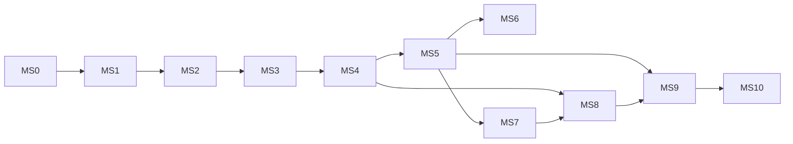

# React Native OTA — Implementation Roadmap

> **Status:** Approved design → implementation planning  
> **Last updated:** 2026-07-18  
> **Contract:** Nothing here may contradict [ARCHITECTURE.md](ARCHITECTURE.md). If a milestone reveals a flaw, update both documents in the same PR.  
> **Grounding:** RN 0.82+ New Architecture (Hermes), verified boot paths in `docs/internals/`.

This roadmap is the project plan for shipping a **production-ready, open-source npm package** (`react-native-ota`) with a self-hostable server and CLI — built from scratch (no CodePush / Expo Updates / EAS Update).

---

## How to read this document

| Layer | Meaning |
|---|---|
| **Epic** | Multi-milestone outcome (business / product capability) |
| **Feature** | Shippable capability inside an epic (maps to modules M1–M14) |
| **Task** | Implementable work unit (days–week) |
| **Subtask** | Concrete file-level or test-level step (hours–day) |
| **Milestone (MS)** | Time-boxed release gate with acceptance criteria |

**Difficulty:** L (1–3 days) · M (3–7 days) · H (1–2 weeks) · VH (2–4+ weeks) — assuming one senior RN/native engineer; calendar time stretches with review and device-farm validation.

**Default sequencing rule:** Android first for native core, then iOS feature-equivalent pass in the same epic before moving on — except where noted.

---

## Program at a glance

```
MS0 Foundation
  → MS1 Bundle Store + Resolver (Android)
  → MS2 Boot Watchdog / Rollback (Android)
  → MS3 iOS Boot-Safe Parity (M2/M1/M6)
  → MS4 Trust Chain (M5 + M14)
  → MS5 Update Loop (M4 + M3 + M9)
  → MS6 Policy + Telemetry (M7 + M8)
  → MS7 Server Plane (M10–M12)
  → MS8 CLI + Release Workflow (M13)
  → MS9 Example App + Device E2E
  → MS10 Production Hardening + npm 1.0
```



| Milestone | Primary modules | Difficulty | Depends on |
|---|---|---|---|
| MS0 | monorepo / tooling | L | — |
| MS1 | M2, M1 (Android) | H | MS0 |
| MS2 | M6 (Android) | H | MS1 |
| MS3 | M2, M1, M6 (iOS) | H | MS2 |
| MS4 | M5, M14 | H | MS1 (store layout) |
| MS5 | M4, M3, M9 | VH | MS2, MS4 |
| MS6 | M7, M8 | M | MS5 |
| MS7 | M10, M11, M12 | VH | MS5 (API contract) |
| MS8 | M13 | H | MS4, MS7 |
| MS9 | example + e2e | VH | MS5–MS8 |
| MS10 | npm release | H | MS9 |

---

## Epic map (company WBS)

| Epic | Name | Outcome |
|---|---|---|
| **E0** | Foundation | Monorepo, packages layout, CI skeleton, shared protocol package |
| **E1** | Boot-Safe Core | Device always boots; OTA slots + resolver + watchdog offline |
| **E2** | Trust Chain | Only signed, hash-verified, runtime-compatible packages become bootable |
| **E3** | Update Loop | Check → download → verify → stage → apply → confirm |
| **E4** | Policy & Observability | Install modes, mandatory UX hooks, funnel telemetry |
| **E5** | Server Plane | Self-hostable release service, storage, analytics + auto-pause |
| **E6** | Developer Plane | CLI: bundle, sign, publish, promote, rollout, rollback, doctor |
| **E7** | Proof & Hardening | Example app, crash-rollback drills, docs, npm 1.0 |

---

# Milestones (detailed)

---

## MS0 — Foundation & Monorepo Scaffold

### Goal
Create the empty product skeleton so every later milestone has a known home for code, tests, and docs — without implementing OTA behavior yet.

### Concepts to learn
- RN library packaging (autolinking, TurboModule codegen layout)
- Monorepo tooling (workspaces / pnpm or yarn)
- Shared TypeScript protocol as the single source of truth

### Native files
- `packages/client/android/` — Gradle module stub, empty `com.rnota` package
- `packages/client/ios/` — podspec stub, empty `RNOta` target
- `packages/client/react-native-ota.podspec`, `build.gradle`

### JS files
- `packages/client/src/index.ts` — placeholder public export
- `packages/protocol/src/` — empty manifest / API type stubs
- Root `package.json`, `tsconfig` bases, lint/format config

### Backend files
- `packages/server/` — package stub only (no routes yet)

### Deliverables
- Folder structure matching ARCHITECTURE.md §7
- CI: typecheck + lint on PRs (no device jobs yet)
- `docs/ROADMAP.md` + README pointers

### Estimated difficulty
**L**

### Dependencies
None (start here).

### Acceptance criteria
- [ ] `packages/{client,protocol,crypto,cli,server}` exist with valid package manifests
- [ ] Client Android/iOS native modules compile as empty libraries in isolation (or documented “wire later” stubs)
- [ ] CI green on empty scaffold
- [ ] No OTA behavior claimed in README yet

### Epic / Feature / Task / Subtask

**Epic E0 — Foundation**

- **Feature F0.1 — Monorepo layout**
  - Task: Create workspace root and packages
    - Subtask: Add `packages/client`, `protocol`, `crypto`, `cli`, `server`
    - Subtask: Wire workspace scripts (`build`, `typecheck`, `lint`)
  - Task: Document contribution entrypoints
    - Subtask: Root README → links to ARCHITECTURE + ROADMAP

- **Feature F0.2 — Client package skeleton**
  - Task: Android Gradle library module
    - Subtask: `com.rnota` namespace + empty `OtaPackage` placeholder
  - Task: iOS podspec skeleton
    - Subtask: Empty `RNOta` umbrella with New Arch flags documented
  - Task: TurboModule codegen folder reserved
    - Subtask: `src/native/NativeOta.ts` stub (unimplemented)

- **Feature F0.3 — Protocol package stub**
  - Task: Export empty `ManifestV1` / `DeviceUpdateResponse` type placeholders
    - Subtask: Align names with ARCHITECTURE.md §9 (no runtime validation yet)

---

## MS1 — Bundle Store + Resolver (Android)

### Goal
On Android, persist OTA slots with atomic `state.json` and answer RN’s “where is the JS?” question via `getJSBundleFile()` — always falling back to the embedded bundle on any failure. **No network, no crypto, no rollback engine yet.**

### Concepts to learn
- Android bridgeless boot: `DefaultReactNativeHost.toReactHost()` snapshots `getJSBundleFile()` once (P1)
- Atomic FS: write-temp → fsync → rename on ext4/f2fs
- `state.json` schema v1 ([specs/state-json.md](specs/state-json.md))
- Why hashing must **not** run on the boot path

### Native files
```
packages/client/android/src/main/java/com/rnota/
  store/
    OtaPaths.kt
    OtaState.kt
    OtaStateCodec.kt
    BundleStore.kt
  resolver/
    BundleResolver.kt
    OtaReactNativeHost.kt          # overrides getJSBundleFile()
    ResolutionRecord.kt            # for later M8
```

### JS files
- None required for runtime (optional: tiny Node test helpers for JSON fixtures under `packages/protocol/fixtures/`)

### Backend files
- None

### Deliverables
- Working Android Bundle Store (init, slots, atomic pointer, GC hooks stubbed)
- Working Android Bundle Resolver (exists-check only; null → embedded)
- Unit tests with fabricated / corrupt / mid-write state files
- Spec compliance with `docs/specs/state-json.md`

### Estimated difficulty
**H**

### Dependencies
MS0; ARCHITECTURE.md M1/M2; android internals doc (P1)

### Acceptance criteria
- [ ] Store layout matches ARCHITECTURE.md (`ota/state.json`, `slots/<id>/`, temp files)
- [ ] Pointer write is atomic; crash between fsync/rename never yields torn JSON
- [ ] Resolver: missing/corrupt/future-schema/missing slot → `null` (embedded)
- [ ] Resolver never throws; budget target &lt; 2ms for happy-path read + `stat`
- [ ] Invalid slot-ids treated as absent (path-traversal defense)
- [ ] `pendingSlot` is **never** returned as the boot path (promotion is MS2)
- [ ] Instrumented unit tests cover the failure table in `state-json.md`

### Epic / Feature / Task / Subtask

**Epic E1 — Boot-Safe Core**

- **Feature F1.1 — M2 Bundle Store (Android)**
  - Task: Path constants and directory bootstrap
    - Subtask: `OtaPaths` — no magic strings
    - Subtask: `ensureStore()` creates `ota/` + `slots/`
  - Task: State codec
    - Subtask: Parse/validate schemaVersion + slot-id regex
    - Subtask: Encode with stable key order (prep for later signing discipline)
  - Task: Atomic replace
    - Subtask: `state.json.tmp` → fsync → rename → fsync parent
  - Task: Slot lifecycle helpers
    - Subtask: `createSlot(id)`, `slotDir(id)`, `isCommitted(id)` (requires `bundle.hbc`)
    - Subtask: `recover()` — drop dangling refs, reset invalid state to EMPTY
  - Task: Unit tests
    - Subtask: Crash-injection at rename boundaries (Robolectric or JVM FS fakes)

- **Feature F1.2 — M1 Bundle Resolver (Android)**
  - Task: Pure resolver function
    - Subtask: Read state → validate active slot exists → return absolute path or null
    - Subtask: Catch-all → null; write `ResolutionRecord`
  - Task: Host integration
    - Subtask: `OtaReactNativeHost.getJSBundleFile()` delegates to resolver
    - Subtask: Document next-launch apply semantics (snapshot) for app integrators
  - Task: Resolver unit tests
    - Subtask: Fabricated states per `state-json.md` failure table
    - Subtask: Startup micro-benchmark harness (optional CI gate later)

---

## MS2 — Rollback Engine & Boot Watchdog (Android)

### Goal
Make bad updates non-permanent: pending boots are two-phase (`PENDING` → `CONFIRMED` via `notifyAppReady`); crash loops auto-flip to `previousSlot` or embedded.

### Concepts to learn
- Two-phase commit for OTA apply
- `boot.json` attempt counters written **before** returning a pending path
- Distinguishing crash vs clean exit (`ApplicationExitInfo` where available)
- Why M6 must be native (JS may never start)

### Native files
```
packages/client/android/.../rollback/
  BootStatus.kt
  BootWatchdog.kt
  RollbackEngine.kt
packages/client/android/.../resolver/
  BundleResolver.kt                 # consults watchdog verdict
packages/client/android/.../OtaTurboModule.kt   # notifyAppReady only (minimal)
```

### JS files
```
packages/client/src/native/NativeOta.ts         # codegen spec: notifyAppReady
packages/client/src/api/notifyAppReady.ts       # thin wrapper (pre-M9 surface)
```

### Backend files
- None

### Deliverables
- `boot.json` read/write + verdict logic
- Resolver integration: pending → attempt++ → path; threshold → rollback then resolve
- Minimal TurboModule: `notifyAppReady()` → CONFIRMED
- Crash-injection / logic unit tests; device-farm drill deferred to MS9

### Estimated difficulty
**H**

### Dependencies
MS1

### Acceptance criteria
- [ ] First boot of pending slot records attempt before path return
- [ ] `notifyAppReady` promotes pending → active, clears attempts, sets previous
- [ ] Attempts ≥ threshold without confirm → pointer to previous/embedded; bad slot quarantined
- [ ] Clean user-kill before ready does **not** falsely roll back when exit-reason APIs allow; otherwise documented conservative default
- [ ] Rollback target missing → embedded
- [ ] Resolver still never throws

### Epic / Feature / Task / Subtask

**Epic E1 — Boot-Safe Core** (continued)

- **Feature F1.3 — M6 Watchdog (Android)**
  - Task: `boot.json` schema + codec
    - Subtask: attempts, lastVerdict, pendingReleaseId
  - Task: Verdict engine
    - Subtask: Table-driven tests for confirm / retry / rollback
  - Task: Wire into resolver
    - Subtask: On pending: record attempt then return path
    - Subtask: On rollback verdict: call store flip, then resolve previous/embedded
  - Task: Minimal JS handshake
    - Subtask: TurboModule `notifyAppReady`
    - Subtask: Dev warning if never called (log-only)

---

## MS3 — iOS Boot-Safe Parity (M2 / M1 / M6)

### Goal
Feature-equivalent Bundle Store, Resolver, and Watchdog on iOS using `bundleURL` (I1) + sandbox storage under Application Support (backup-excluded).

### Concepts to learn
- iOS closure semantics: `bundleURL` re-called on every reload (instant apply free)
- `RCTTriggerReloadCommandListeners` as apply trigger (used later in MS5)
- App Store 3.3.2 implications (JS OTA allowed; document for integrators)
- Atomic replace on APFS

### Native files
```
packages/client/ios/RNOta/
  Store/   OtaPaths.swift, OtaState.swift, OtaStateCodec.swift, BundleStore.swift
  Resolver/ OtaBundleResolver.swift, ResolutionRecord.swift
  Rollback/ BootWatchdog.swift, RollbackEngine.swift
  OtaTurboModule.mm
```

### JS files
- Reuse MS2 TurboModule spec (no platform fork in public API)

### Backend files
- None

### Deliverables
- iOS store/resolver/watchdog mirroring Android contracts
- Shared fixture tests (same `state.json` / `boot.json` vectors both platforms)
- Integrator notes: override `bundleURL` / `sourceURLForBridge:`

### Estimated difficulty
**H**

### Dependencies
MS2 (behavior freeze on Android becomes the contract)

### Acceptance criteria
- [ ] Identical `state.json` / slot / failure semantics as Android
- [ ] `bundleURL` returns file URL or nil → embedded `main.jsbundle`
- [ ] Watchdog parity including `notifyAppReady`
- [ ] OTA dir excluded from backup
- [ ] Cross-platform fixture suite passes on both

### Epic / Feature / Task / Subtask

**Epic E1 — Boot-Safe Core** (close-out)

- **Feature F1.4 — iOS Store + Resolver + Watchdog**
  - Task: Port store atomics to Swift
  - Task: `OtaBundleResolver` for AppDelegate glue
  - Task: Watchdog + TurboModule ObjC++ bridge
  - Task: Shared protocol fixtures consumed by XCTest + Android tests

---

## MS4 — Trust Chain (Verifier + Signing)

### Goal
Nothing becomes a committed bootable slot unless Ed25519 signature + SHA-256 hashes + `runtimeVersion` checks pass. Publisher signs offline; device verifies with baked-in public keys.

### Concepts to learn
- Ed25519 detached signatures over canonical JSON
- Manifest as Merkle-style root over bundle + assets
- Safe zip extraction (traversal, bombs, symlinks)
- Key rotation via key *list* in the binary
- Why the server must never hold private keys

### Native files
```
packages/client/android/.../verifier/ PackageVerifier.kt, ZipGuard.kt, Hashing.kt
packages/client/ios/RNOta/Verifier/   PackageVerifier.swift, ZipGuard.swift, Hashing.swift
```

### JS files
```
packages/crypto/src/          # canonical JSON, sign/verify (CLI-side)
packages/protocol/src/manifest.ts
packages/protocol/fixtures/   # known-answer signed packages
```

### Backend files
- None for verification (server stores signatures only — exercised in MS7)

### Deliverables
- M5 verifier on Android + iOS
- M14 crypto package + keygen helpers
- Build-time public key embedding hooks (Gradle resource + Info.plist) — documented
- `ota doctor` verification logic shareable with verifier (CLI command may land in MS8; library API ready)

### Estimated difficulty
**H**

### Dependencies
MS1 (slot quarantine → verified transition); protocol types from MS0

### Acceptance criteria
- [ ] Invalid signature → slot destroyed + typed `E_SIG`
- [ ] Any asset hash mismatch → full reject (`E_HASH`)
- [ ] `runtimeVersion` mismatch → `E_RUNTIME_MISMATCH`
- [ ] Zip traversal / bomb corpus rejected (`E_ZIP_UNSAFE`)
- [ ] Same fixture package verifies identically on Android, iOS, and JS crypto
- [ ] Key list rotation: package verifies if **any** baked key matches

### Epic / Feature / Task / Subtask

**Epic E2 — Trust Chain**

- **Feature F2.1 — M14 Signing spec + JS crypto**
  - Task: Canonical JSON spec + test vectors
  - Task: Keygen / sign / verify APIs
  - Task: Document private-key handling (env/KMS; never repo)

- **Feature F2.2 — M5 Verifier (Android)**
  - Task: Manifest parse + sig verify
  - Task: Hash walk of `bundle.hbc` + assets
  - Task: ZipGuard extraction into quarantine
  - Task: Mark slot verified only after all checks

- **Feature F2.3 — M5 Verifier (iOS)**
  - Task: Feature-equivalent Swift implementation
  - Task: Cross-platform known-answer suite

- **Feature F2.4 — Public key embedding**
  - Task: Android assets/res injection
  - Task: iOS plist / xcconfig injection
  - Task: Multi-key list format

---

## MS5 — Update Loop (Downloader + Manager + Public API)

### Goal
After boot, the app can check a server, download in background, verify, stage, and apply per policy hooks — without endangering the current boot. Public JS API is usable by host apps.

### Concepts to learn
- Single-flight update state machine
- Background transfer: WorkManager / URLSession background
- HTTP Range resume; Content-Length vs `packageSize`
- Android instant apply requires custom `ReactHostDelegate` (P3) + `reload()`; iOS uses I1+I5
- JS↔native SDK version skew (JS ships inside OTA bundles)

### Native files
```
packages/client/android/.../downloader/ OtaDownloader.kt, DownloadWorker.kt
packages/client/ios/RNOta/Downloader/   OtaDownloader.swift
packages/client/android/.../resolver/   OtaReactHostDelegate.kt   # instant mode
```

### JS files
```
packages/client/src/
  api/          OtaClient.ts, events, useOtaUpdate.ts
  manager/      UpdateManager.ts, states.ts
  native/       full TurboModule spec
  index.ts      public exports
```

### Backend files
- Mock device API for integration tests (can live under `packages/server` or `e2e/mocks`)

### Deliverables
- M4 resumable downloader (both platforms)
- M3 state machine + persistence re-entry
- M9 public API: `configure`, `checkForUpdate`, `sync`, `notifyAppReady`, `getCurrentRelease`, `rollbackToEmbedded`, events, hook
- Integration tests against mock CDN + mock check endpoint

### Estimated difficulty
**VH**

### Dependencies
MS2/MS3 (store + watchdog), MS4 (verify before stage)

### Acceptance criteria
- [ ] State machine: only legal transitions; illegal ones rejected
- [ ] Download resume after network flap; oversize rejected early
- [ ] Verify failure abandons slot; never flips pointer
- [ ] Stage sets `pendingSlot` atomically; apply respects MS2/MS3 watchdog
- [ ] `sync()` auto-calls `notifyAppReady` by default
- [ ] Single-flight: concurrent `checkForUpdate` coalesces
- [ ] Offline: check failure is silent no-op
- [ ] TypeScript strict public types published from package entry

### Epic / Feature / Task / Subtask

**Epic E3 — Update Loop**

- **Feature F3.1 — M4 Downloader**
  - Task: Android WorkManager pipeline + Range resume
  - Task: iOS URLSession background configuration
  - Task: Progress events to JS
  - Task: Fault-injecting HTTP integration tests

- **Feature F3.2 — M3 Update Manager**
  - Task: Canonical state machine + persistence
  - Task: Sequence M4 → M5 → M2 stage
  - Task: Re-entry from STAGED after process death
  - Task: Exhaustive transition unit tests

- **Feature F3.3 — M9 Public JS API**
  - Task: `OtaClient` facade (no logic beyond delegation)
  - Task: Event emitter + `useOtaUpdate`
  - Task: `markCriticalSection` stub wired for MS6 policy
  - Task: Backward-compat note: additive TurboModule only

- **Feature F3.4 — Apply modes (platform)**
  - Task: Android next-launch (default) vs instant (P3 delegate)
  - Task: iOS reload via `RCTTriggerReloadCommandListeners`
  - Task: Document integrator setup for both modes

---

## MS6 — Policy Engine + Telemetry Client

### Goal
Separate *whether/when* to apply (M7) from *how* (M3), and emit a privacy-safe deployment funnel (M8) with opt-out and fully functional “no telemetry” builds.

### Concepts to learn
- Policy precedence (`mandatory` vs install modes)
- Metered network / frequency caps
- Durable offline event queues; anonymous `clientId`
- CDN-cacheable check responses (client still authoritative via signatures)

### Native files
- Optional: none new (prefer JS for M7/M8); native only if queue durability needs platform FS helpers already in store

### JS files
```
packages/client/src/policy/   UpdatePolicy.ts
packages/client/src/telemetry/ TelemetryClient.ts, eventTypes.ts
```

### Backend files
- Ingestion contract types in `packages/protocol` (server implements in MS7)

### Deliverables
- M7 pure policy engine + table tests
- M8 batching client with ring buffer + opt-out flag
- Wiring into M3/M9 (`installMode`, mandatory UX callback contract)

### Estimated difficulty
**M**

### Dependencies
MS5

### Acceptance criteria
- [ ] Policy matrix covered by pure-function tests
- [ ] Mandatory cannot override M5 rejection
- [ ] Critical section blocks IMMEDIATE reload
- [ ] Telemetry disabled build: zero network from M8; update loop still works
- [ ] Event wire format contains no PII fields (privacy audit test)
- [ ] Queue survives process restart; oldest dropped at cap

### Epic / Feature / Task / Subtask

**Epic E4 — Policy & Observability**

- **Feature F4.1 — M7 Policy**
  - Task: Interpret manifest + config overrides
  - Task: Precedence docs + tests
  - Task: Critical-section integration with manager

- **Feature F4.2 — M8 Telemetry client**
  - Task: Durable queue + batch/retry
  - Task: Anonymous clientId lifecycle
  - Task: Opt-out / compile-time kill switch

---

## MS7 — Server Plane (Release, Storage, Analytics)

### Goal
Ship a self-hostable reference server: device check API, management API, pluggable storage, analytics ingestion with rollout auto-pause on high rollback rate.

### Concepts to learn
- Deterministic rollout bucketing (`hash(clientId + releaseId) % 100`)
- Immutable releases; promotion = new pointer row
- Fail-safe: DB down → device API returns `upToDate`
- Content-addressed blobs; storage adapter as OSS extension point
- Server never sees private signing keys

### Native files
- None

### JS files
- `packages/protocol` — finalize OpenAPI-aligned types + shared fixtures with client

### Backend files
```
packages/server/src/
  device-api/
  mgmt-api/
  ingestion/
  health/
  storage/{local,s3}/
migrations/   # Postgres schema per ARCHITECTURE.md §8
```

### Deliverables
- Postgres migrations matching §8
- Device `GET /v1/device/update` + `POST /v1/device/events`
- Management CRUD: apps, channels, releases, publish, rollout, rollback, keys
- `StorageAdapter` + local + S3-compatible implementations
- Health rules → auto-pause + webhook hook
- Contract tests shared with client fixtures

### Estimated difficulty
**VH**

### Dependencies
MS5 (client expects §9 shapes); MS4 (stores signatures, does not create them)

### Acceptance criteria
- [ ] Decision-matrix tests for targeting + rollout bucketing
- [ ] Publish finalize verifies blob readback hash before release is live
- [ ] Compromised server without private key cannot forge a client-accepted package (documented + test with wrong sig)
- [ ] Ingestion idempotent by `batch_id`
- [ ] rollbackRate threshold pauses channel_release
- [ ] Local storage adapter passes conformance suite; S3 adapter too
- [ ] Device API degrades safely when DB unavailable

### Epic / Feature / Task / Subtask

**Epic E5 — Server Plane**

- **Feature F5.1 — M10 Release service**
  - Task: Schema migrations
  - Task: Device check endpoint + cache headers
  - Task: Management auth (API keys) + audit log
  - Task: Publish / promote / rollout / rollback flows

- **Feature F5.2 — M11 Storage adapter**
  - Task: Interface + local disk
  - Task: S3-compatible implementation
  - Task: Conformance test suite (the OSS extension contract)

- **Feature F5.3 — M12 Analytics ingestion**
  - Task: Event ingest + aggregates
  - Task: Health rule engine + auto-pause
  - Task: Load-shed / sampling under pressure

---

## MS8 — CLI & Release Workflow (M13)

### Goal
CI-friendly `ota` CLI: bundle with **app-local** `hermesc`, sign, publish, promote, rollout, rollback, keys, and `doctor` (same verifier semantics as M5).

### Concepts to learn
- Hermes bytecode version lock to installed `libhermes`
- Resolving Metro/hermesc from the **app’s** `node_modules`
- Presigned upload + finalize handshake with M10/M11

### Native files
- None (may invoke Android/iOS embedding scripts for public keys)

### JS files
```
packages/cli/src/commands/
  bundle.ts, sign.ts, publish.ts, promote.ts, rollout.ts,
  rollback.ts, doctor.ts, keys.ts
packages/cli/src/index.ts
```

### Backend files
- Uses Management API only

### Deliverables
- Published `ota` bin from `packages/cli`
- Golden-file tests for package/manifest layout
- `ota doctor` byte-compatible with device verifiers
- CI docs: recommended pipeline for staging → production

### Estimated difficulty
**H**

### Dependencies
MS4 (crypto), MS7 (management API); MS5 helpful for e2e dry-run

### Acceptance criteria
- [ ] `ota bundle` hard-errors on hermesc/RN mismatch with actionable message
- [ ] `ota sign` never writes private key to config
- [ ] `ota publish` idempotent; finalize only after hash readback
- [ ] `ota doctor` matches M5 verdicts on fixtures
- [ ] `--json` output on all commands for CI
- [ ] Prod publish confirmation gate (overridable with `--yes`)

### Epic / Feature / Task / Subtask

**Epic E6 — Developer Plane**

- **Feature F6.1 — Bundle + sign**
  - Task: Metro invocation + asset collection
  - Task: hermesc resolution from host app
  - Task: Sign via packages/crypto

- **Feature F6.2 — Publish lifecycle**
  - Task: Register release → upload → finalize
  - Task: Promote / rollout / rollback commands

- **Feature F6.3 — Doctor + keys**
  - Task: Local verify identical to M5
  - Task: keys generate/rotate + embedding helpers

---

## MS9 — Example App + Device E2E

### Goal
Prove the full loop on real devices/simulators: publish → check → download → verify → stage → apply → confirm; and the crash-rollback path that justifies the design.

### Concepts to learn
- Device-farm crash injection
- Hermes reject / top-level throw before `notifyAppReady`
- Measuring resolver budget on low-end Android

### Native files
- `example/android`, `example/ios` — integrator wiring (host + delegate as needed)

### JS files
- `example/` RN 0.82 app using public API
- `e2e/` scenarios

### Backend files
- Local server profile / docker-compose for example

### Deliverables
- Example app against local server
- E2E suite: happy path + auto-rollback within N launches
- Chaos notes / scripts for corrupt state between launches

### Estimated difficulty
**VH**

### Dependencies
MS5–MS8

### Acceptance criteria
- [ ] Fresh install boots embedded
- [ ] Published update stages and applies on next restart (and instant mode on both platforms where enabled)
- [ ] Deliberately crashing bundle rolls back within threshold; subsequent launch healthy
- [ ] Tampered package never stages
- [ ] Airplane mode: app remains usable; updates resume later
- [ ] Telemetry funnel visible for a release (offered → confirmed / rolled_back)

### Epic / Feature / Task / Subtask

**Epic E7 — Proof & Hardening** (start)

- **Feature F7.1 — Example app**
  - Task: Wire OtaReactNativeHost / bundleURL
  - Task: Embed public key; point at local server
  - Task: Demo UI for sync / critical section / rollback

- **Feature F7.2 — E2E drills**
  - Task: Happy-path automation
  - Task: Crash-at-load + crash-after-N-seconds bundles
  - Task: State corruption monkey test

---

## MS10 — Production Hardening & npm 1.0

### Goal
Ship a trustworthy open-source release: versioning, docs, security posture, SemVer policy, and a reproducible publish pipeline for `react-native-ota`, `@rnota/cli`, and optional server image.

### Concepts to learn
- SemVer for native modules (native breaking vs JS additive)
- OSS security: threat model, key leak runbook, SUPPLY_CHAIN notes
- npm package contents (no secrets, correct `react-native` config)

### Native files
- Final polish only (ProGuard/R8 consumer rules, privacy manifests if needed)

### JS files
- API finalization; deprecate experimental flags
- Changelog + migration notes

### Backend files
- Docker image + self-hosting guide
- Backup/retention recommendations

### Deliverables
- Threat model doc + self-hosting runbook
- npm packages published (1.0.0)
- CI: Android + iOS build, unit + contract + selected e2e
- License, CODE_OF_CONDUCT, CONTRIBUTING, security policy

### Estimated difficulty
**H**

### Dependencies
MS9 green on primary matrix (RN 0.82 Android + iOS)

### Acceptance criteria
- [ ] Public API frozen for 1.0; TurboModule changes additive-only policy documented
- [ ] `npm pack` contents audited (no `.env`, no private keys, no example secrets)
- [ ] Self-host guide: bring-up server + publish first release in &lt; 1 hour for a new integrator
- [ ] Security policy + key-leak runbook published
- [ ] CI matrix documented (RN 0.82 required; 0.83+ tracked)
- [ ] Deferred items explicitly listed (diffs, encryption, multi-bundle) per ARCHITECTURE.md §10

### Epic / Feature / Task / Subtask

**Epic E7 — Proof & Hardening** (close-out)

- **Feature F7.3 — Documentation**
  - Task: Integrator guide (Android + iOS)
  - Task: Self-hosting + threat model
  - Task: API reference generated from TS

- **Feature F7.4 — Release engineering**
  - Task: Changesets / SemVer automation
  - Task: npm publish pipeline + provenance
  - Task: GitHub Release checklist

- **Feature F7.5 — Hardening backlog triage**
  - Task: Confirm deferred scope (§10) remains out of 1.0
  - Task: File issues for diffs / encryption hooks / split bundles

---

# Cross-cutting workstreams (apply every milestone)

| Workstream | Rule |
|---|---|
| **Security** | Never skip hash/signature; never trust CDN/server for integrity |
| **Rollback** | Never delete previous verified slot before new slot is verified + confirmed path exists |
| **Embedded fallback** | Any boot-path failure → embedded; store is always disposable |
| **Platform parity** | Android feature lands behind a flag until iOS parity task is scheduled (except MS1→MS2 Android-first by design) |
| **Docs-as-contract** | Behavior changes update ARCHITECTURE.md / specs in the same PR |
| **Testing** | Prefer offline unit/property tests early; device farm concentrates in MS9 |

---

# Suggested team shape (optional)

| Role | Focus |
|---|---|
| Native Android | MS1, MS2, M4 Android, P3 instant apply |
| Native iOS | MS3, M4 iOS, reload path |
| JS SDK | M3, M7, M8, M9 |
| Crypto / protocol | M14, M5 vectors, canonical JSON |
| Backend | M10–M12 |
| CLI / DX | M13, example, docs |
| QA | Crash drills, monkey state corruption, RN version matrix |

Solo path: follow MS0→MS10 strictly; do not start MS5 until MS2 acceptance is green.

---

# Definition of Done — production-ready npm package

The project is **1.0 production-ready** when all of the following are true:

1. **Boot-safe:** corrupt/missing OTA state never bricks; embedded always boots (MS1–MS3).
2. **Crash-safe:** bad update auto-rolls back within configured attempts (MS2/MS3 + MS9 drill).
3. **Trust-safe:** unsigned or tampered packages cannot stage (MS4 + MS9).
4. **Update loop works offline-first** with background download (MS5).
5. **Self-hostable** server + CLI can publish and target channels/rollouts (MS7–MS8).
6. **Public API** is documented, typed, and SemVer-stable (MS10).
7. **No third-party OTA dependency** in the dependency tree for core update behavior.

---

# Immediate next action

Start **MS0** (scaffold), then **MS1** exactly as scoped: **Android M2 Bundle Store + M1 Resolver only** — no downloader, server, verifier, manager, or full public API. M6 follows as **MS2** once MS1 acceptance is green.
